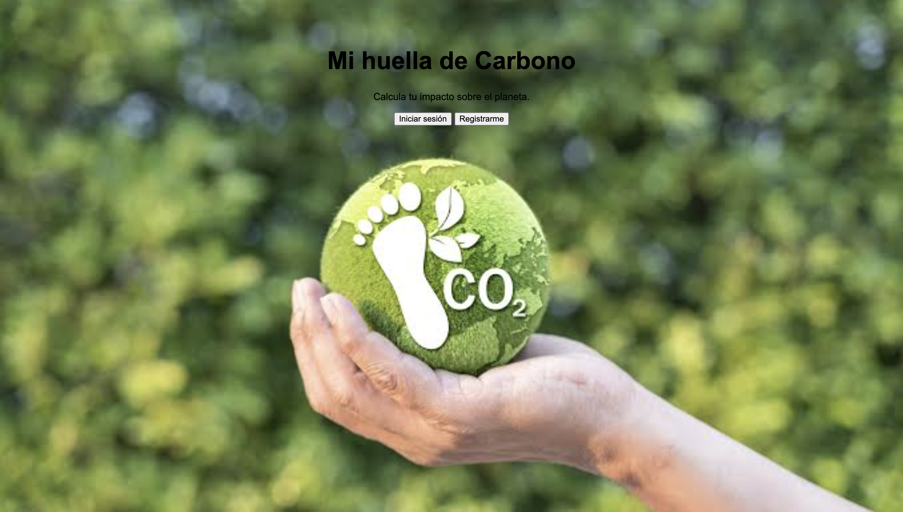
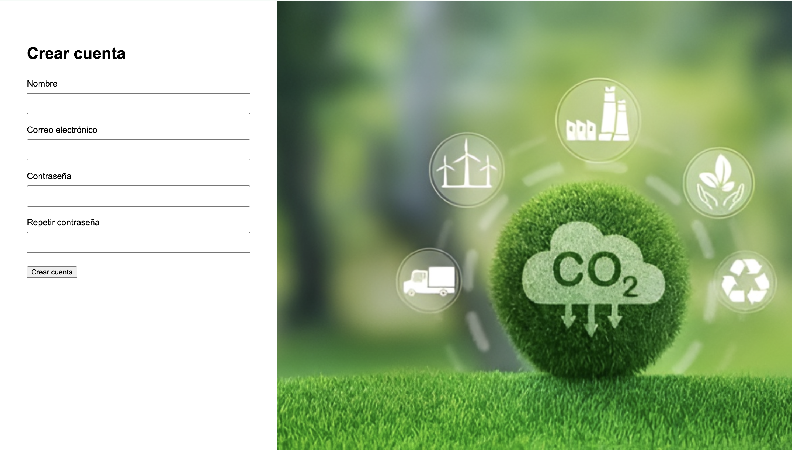
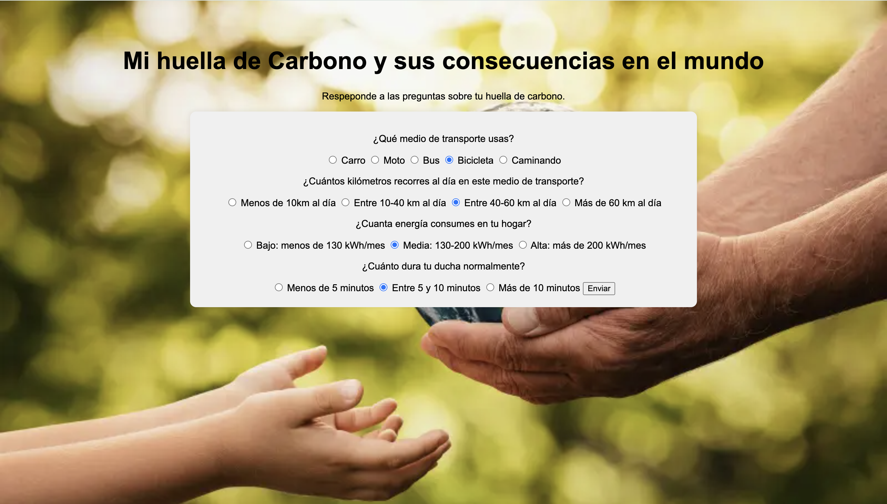
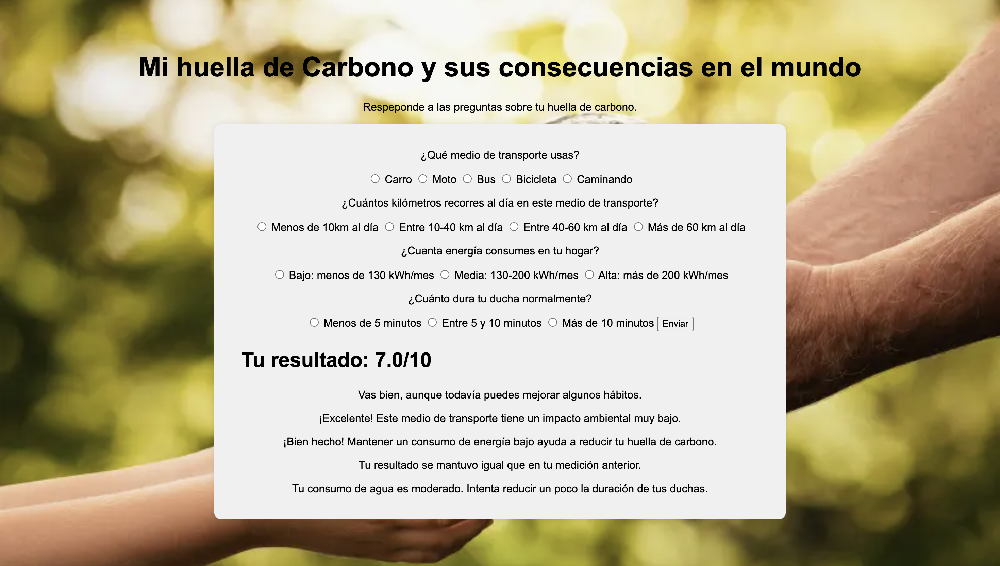

# Mi Huella de Carbono

Hola, mi nombre es **Juan Felipe Ramírez Peña**. Este es mi proyecto de graduación del programa **Python Pro de Kodland**.

## Descripción del proyecto

Mi idea para este proyecto es crear una aplicación web utilizando Python que permita evaluar algunos hábitos relacionados con el impacto ambiental.

El programa realizará cuatro preguntas sobre los hábitos del usuario y, a partir de sus respuestas, calculará una puntuación y le dará una retroalimentación con recomendaciones para mejorar.

Además, el usuario podrá crear una cuenta y volver a realizar el cuestionario después de un tiempo. De esta manera, el programa podrá comparar su nuevo resultado con el anterior e indicarle si **mejoró, empeoró o se mantuvo igual**.

El proyecto será desarrollado en **Visual Studio Code**, utilizando principalmente:

- Python
- Flask
- HTML
- CSS
- SQLite

## Funciones y características

La aplicación cuenta con las siguientes funciones:

- Registro de usuarios mediante nombre, correo electrónico y contraseña.
- Inicio de sesión para que cada usuario pueda acceder a su información.
- Cuestionario sobre hábitos relacionados con la huella de carbono.
- Evaluación del medio de transporte utilizado.
- Evaluación de la distancia recorrida diariamente.
- Evaluación del consumo de energía en el hogar.
- Evaluación de la duración de las duchas.
- Cálculo de una puntuación final de 1 a 10.
- Retroalimentación personalizada según las respuestas del usuario.
- Recomendaciones sobre transporte, consumo de energía y uso del agua.
- Almacenamiento de los resultados en una base de datos.
- Comparación del resultado actual con el resultado anterior.
- Indicación de si el usuario mejoró, empeoró o se mantuvo igual.

## Demostración del funcionamiento

A continuación se muestran algunas capturas de pantalla del funcionamiento de la aplicación.

### Página de bienvenida

En esta página el usuario puede elegir entre iniciar sesión o crear una cuenta.



### Registro de usuario

El usuario puede crear una cuenta utilizando su nombre, correo electrónico y contraseña.



### Inicio de sesión

Los usuarios registrados pueden ingresar a la aplicación con su correo electrónico y contraseña.


### Cuestionario

El usuario responde preguntas relacionadas con sus hábitos de transporte, consumo de energía y consumo de agua.



### Resultado y retroalimentación

Al finalizar, la aplicación calcula una puntuación y muestra recomendaciones personalizadas.



## Instalación y uso

Para ejecutar este proyecto en un computador se deben seguir los siguientes pasos:

### 1. Descargar el proyecto

Clonar el repositorio desde GitHub:

```bash
git clone URL-DE-TU-REPOSITORIO

### 2. Entrar a la carpeta del proyecto

```bash
cd Proyecto_PythonPro_Kodland
```

### 3. Crear un entorno virtual

```bash
python3 -m venv .venv
```

### 4. Activar el entorno virtual

En macOS o Linux:

```bash
source .venv/bin/activate
```

### 5. Instalar las librerías necesarias

```bash
pip install flask flask-sqlalchemy flask-login
```

### 6. Ejecutar el programa

```bash
python main.py
```

### 7. Abrir la aplicación

Abrir en el navegador:

```text
http://127.0.0.1:5000
```

En la primera línea debes reemplazar:

```text
URL-DE-TU-REPOSITORIO
```

por la dirección real de tu repositorio de GitHub.

## Comentarios y participación

Los usuarios pueden compartir sus opiniones, sugerencias o reportar errores a través de la sección **Issues** del repositorio en GitHub.

También pueden proponer nuevas ideas para mejorar el proyecto, por ejemplo:

- Agregar nuevas preguntas al cuestionario.
- Mejorar el sistema de puntuación.
- Incluir nuevas recomendaciones ambientales.
- Mejorar el diseño de la aplicación.
- Agregar gráficos para mostrar la evolución del usuario.

Las sugerencias pueden ayudar a mejorar futuras versiones del proyecto.

## Conclusión

Este proyecto busca crear conciencia sobre cómo algunos hábitos cotidianos pueden influir en nuestro impacto ambiental.

A través de un cuestionario sencillo, la aplicación permite que cada usuario evalúe aspectos relacionados con el transporte, el consumo de energía y el uso del agua, obteniendo una puntuación y recomendaciones para mejorar.

Una de las principales características del proyecto es que los usuarios pueden volver a realizar el cuestionario y comparar sus resultados con mediciones anteriores, lo que permite observar si sus hábitos han mejorado, empeorado o se han mantenido.

Este proyecto también me permitió aplicar conocimientos de Python, Flask, HTML, CSS y bases de datos en una aplicación web funcional.

En el futuro, la aplicación podría ampliarse con nuevas preguntas, cálculos más precisos de huella de carbono, gráficas de evolución y recomendaciones más detalladas.
